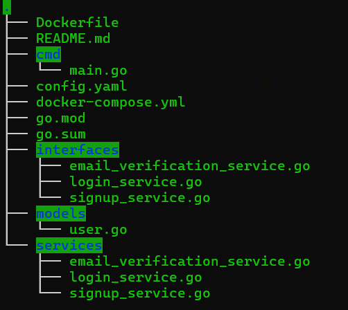

# Signup-Login Service

This project implements a user signup, login, and logout service using Go, Redis, and PostgreSQL. The signup process includes LinkedIn OAuth integration, email verification, and session management using Redis.

## Table of Contents

- [Project Structure](#project-structure)
- [Features](#features)
- [Prerequisites](#prerequisites)
- [Configuration](#configuration)
- [Building and Running the Project](#building-and-running-the-project)
- [Docker Setup](#docker-setup)
- [License](#license)

## Project Structure




## Features

- **LinkedIn OAuth Integration**: Users can sign up using their LinkedIn credentials.
- **Email Verification**: Email verification via OTP with retry mechanism.
- **User Authentication**: JWT-based authentication and session management.
- **Session Management**: Session tokens are stored in Redis with TTLs based on LinkedIn JWT expiration.

## Prerequisites

- **Go 1.20+**
- **Docker** and **Docker Compose**
- **Redis** and **PostgreSQL** (via Docker Compose)

## Configuration

All the configuration values for the application are stored in the `config.yml` file.

### Sample `config.yml`

```yaml
app:
  port: 8080
  env: development

database:
  host: localhost
  user: youruser
  password: yourpassword
  dbname: yourdb
  port: 5432
  sslmode: disable

redis:
  host: localhost
  port: 6379
  password: ""

jwt:
  secret: your_jwt_secret
```

## Building and Running the Project

1 - Install dependencies:

* ``go mod tidy``

2 - Build the project:

* ``go build -o user-service .``

3 - Run the application:

* ``./user-service -config=PATH_TO_CONFIG_YAML``


##  Docker Setup

To run the application along with Redis and PostgreSQL using Docker, you can use the provided `Dockerfile` and `docker-compose.yml`.


1 - Build the Docker image:

*  ``docker build -t user-service .``

2 - Run the services using Docker Compose:

* ``docker-compose up -d``


## License
This project is licensed under the MIT License. See the LICENSE file for more details.

### **Conclusion**

This `README.md` provides a comprehensive overview of the project, including setup instructions, configuration details, and usage examples. It serves as a guide for anyone who wants to understand, run, or contribute to the project.
